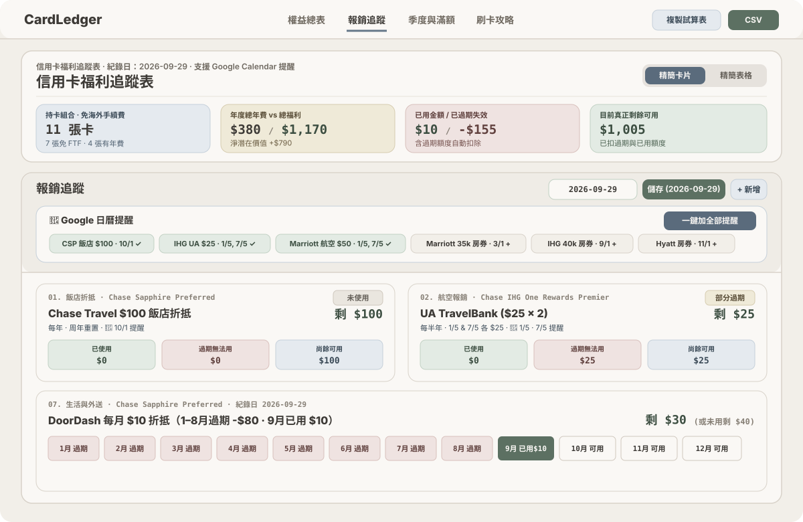

# CardLedger — 信用卡福利追蹤表



## 核心功能亮點

- **手機友善介面**：支援「精簡卡片」與「精簡表格」切換，清楚標示免海外交易手續費，詳細條款收合於下拉選單。
- **年度報銷與免房券追蹤**：依時序排列各項福利，記錄追蹤日期並自動計算「已使用」、「過期無法用」與「尚餘可用」額度。
- **Google Calendar 提醒整合**：一鍵或單項設定年度福利與免房券的每年自動重複日曆提醒。
- **季度與滿額進度追蹤**：追蹤季度 5% 輪替類別與年度刷卡滿額門檻進度。
- **最佳刷卡通路速查與匯出**：依消費類別快速查詢主力卡，並支援匯出高清 PNG 截圖與 CSV 試算表。
- **每月自動更新與自動發布設定**：支援設定每月定期排程，自動審查信用卡權益、重置月度額度、過期福利結清、自動推播至 Google 日曆與試算表備份，並自動建置發布最新版應用至預覽網址。提供即時流水線測試與執行紀錄日誌。

## 本地啟動

```bash
npm install
npm run dev
```
